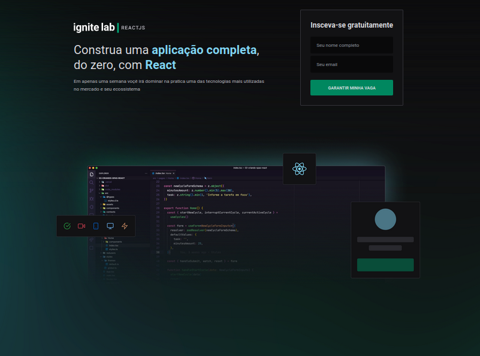
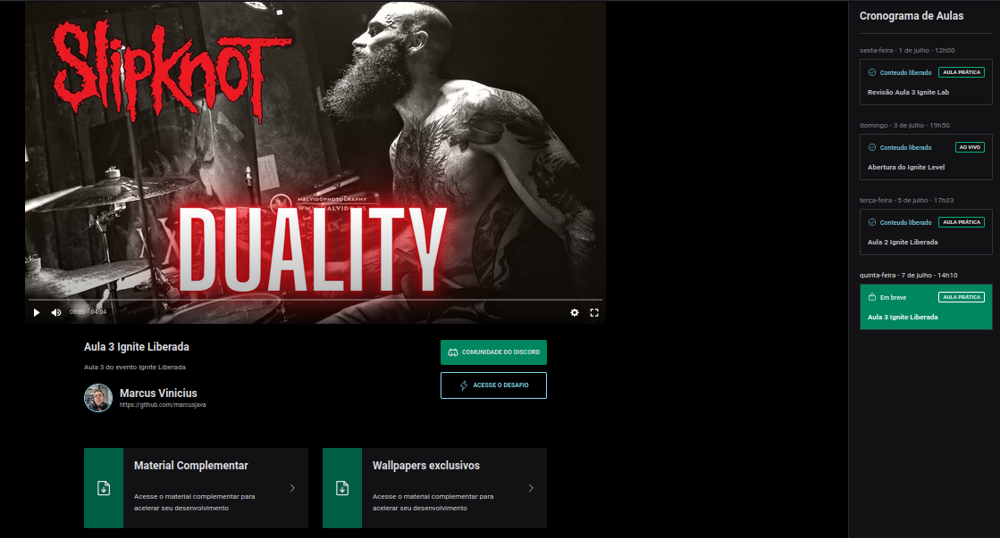

# Welcome to Rocketseat Ignite Lab Plataform React App

---

[types-url]: https://img.shields.io/badge/TypeScript-007ACC?style=for-the-badge&logo=typescript&logoColor=white

## React Platform App

Projeto desenvolvido durante a semana Ignite Lab realizada pela Rocketseat.

## Tecnologias utilizadas

- React
- GraphQl
- Typescript
- TailwindCSS

## Demo

##### Vercel

Online demo: https://rocket-platform-lab.vercel.app/

## Instalação

- Clonar o repositorio - https://github.com/marcusjava/rocket-platform-lab
-

```js
npm install

npm run dev
```

**Note:** Above example will always fetch the latest version. To fetch a specific version, use `https://unpkg.com/react-dropdown-tree-select@<version>/dist/...`
Visit [unpkg.com](https://unpkg.com/#/) to see other options.

```

```
